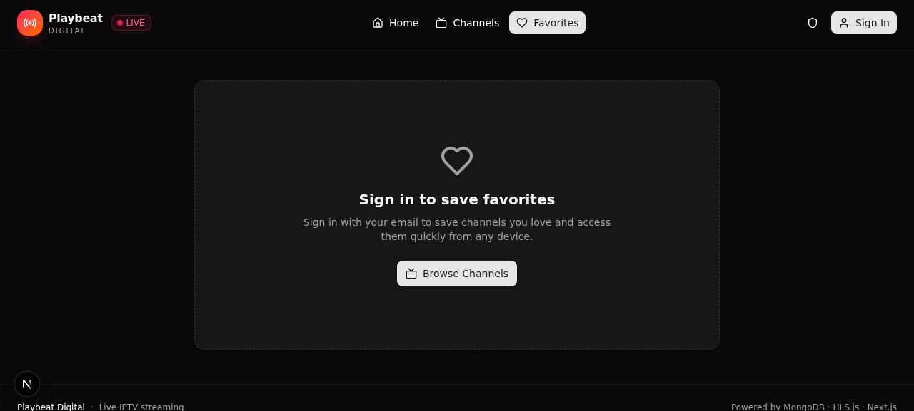

# 🎬 Playbeat Digital

> Live IPTV streaming — premium quality, rock-solid stability.

Playbeat Digital is a modern IPTV media player built with Next.js 16, TypeScript, and MongoDB Atlas. It connects to any Xtream Codes–compatible IPTV service and streams live channels with a polished, dark-themed UI.



## ✨ Features

| Feature | Description |
|---------|-------------|
| **Live Channels** | Browse hundreds of live channels organized by category. Search by name, tap to play. |
| **HLS.js Player** | Auto-recovery from network/media errors, low-latency mode, quality selector, fullscreen. |
| **User Accounts** | Email-based sign-in. Your data syncs across sessions. |
| **Favorites** | Save channels you love with a single tap. Quick access from a dedicated tab. |
| **Watch History** | Automatic tracking with a "Continue Watching" section on the home page. |
| **Admin Panel** | Password-protected dashboard at `/admin` with server status, user management, and IPTV config. |
| **MongoDB Atlas** | Cloud-hosted database for users, favorites, watch history, and admin sessions. |

## 🛠 Tech Stack

- **Framework:** Next.js 16 (App Router) + TypeScript 5
- **Styling:** Tailwind CSS 4 + shadcn/ui (New York)
- **Database:** MongoDB Atlas via Prisma ORM
- **Streaming:** HLS.js 1.6 with auto-error-recovery
- **Auth:** HTTP-only cookies + HMAC-signed tokens (users) + DB-backed sessions (admin)
- **State:** Zustand (client) + TanStack Query (server, available)
- **Icons:** Lucide React
- **Notifications:** Sonner

## 🚀 Getting Started

### 1. Clone & Install

```bash
git clone https://github.com/uzzirulzz-cyber/IPTV.git
cd IPTV
bun install   # or: npm install / pnpm install
```

### 2. Configure Environment

```bash
cp .env.example .env
```

Edit `.env` and fill in your values:

| Variable | Description |
|----------|-------------|
| `MONGODB_URL` | MongoDB Atlas connection string |
| `IPTV_URL` | Your Xtream Codes server URL (e.g. `http://your-server:8080`) |
| `IPTV_USERNAME` | IPTV account username |
| `IPTV_PASSWORD` | IPTV account password |
| `ADMIN_EMAIL` | Admin panel login email |
| `ADMIN_PASSWORD` | Admin panel login password |

### 3. Set Up the Database

```bash
bun run db:push      # Creates collections & indexes in MongoDB Atlas
bun run db:generate  # Regenerates the Prisma client
```

### 4. Run the Dev Server

```bash
bun run dev
```

Open [http://localhost:3000](http://localhost:3000) in your browser.

### 5. Lint & Type-Check

```bash
bun run lint         # ESLint — should pass with 0 errors
bunx tsc --noEmit    # TypeScript — should pass with 0 errors
```

## 📁 Project Structure

```
src/
├── app/
│   ├── api/                    # Next.js API routes (App Router)
│   │   ├── admin/              # Admin: verify, signout, stats, users, iptv-config
│   │   ├── auth/               # Auth: signin, signout, me
│   │   ├── favorites/          # Favorites CRUD
│   │   ├── iptv/               # IPTV: catalog, stream, health
│   │   └── watch-history/      # Watch history CRUD
│   ├── globals.css             # Dark premium theme
│   ├── layout.tsx              # Root layout with metadata
│   └── page.tsx                # Main page (view-state routing)
├── components/
│   ├── admin/                  # Admin login + dashboard (4 tabs)
│   ├── channels/               # Channel browser with sidebar
│   ├── favorites/              # Favorites grid view
│   ├── home/                   # Home with hero + continue watching
│   ├── layout/                 # App header with nav + auth
│   ├── player/                 # HLS.js video player
│   └── ui/                     # shadcn/ui components
├── hooks/
│   ├── use-auth.ts             # Global auth state (shared subscription)
│   ├── use-mobile.ts           # Mobile detection
│   └── use-toast.ts            # Toast notifications
├── lib/
│   ├── auth.ts                 # User + admin auth (cookies, tokens, sessions)
│   ├── db.ts                   # Prisma client
│   ├── iptv.ts                 # Xtream Codes API client
│   └── utils.ts                # cn() utility
└── store/
    └── app-store.ts            # Zustand: view state (home/channels/favorites/player/admin)

prisma/
└── schema.prisma               # MongoDB schema: User, Favorite, WatchHistory, AdminSession
```

## 🔐 Admin Panel

Navigate to `/admin` and sign in with your `ADMIN_EMAIL` / `ADMIN_PASSWORD`.

The dashboard has four tabs:

1. **Overview** — Total users, favorites, watch events + IPTV service status
2. **Users** — List all registered users with delete capability
3. **Server** — Live IPTV server info (URL, ports, protocol, timezone, active connections)
4. **IPTV Config** — Streaming config, MongoDB database details, IPTV credentials, channel categories

## 🎥 Video Player

The player is powered by **HLS.js** and tuned for stability:

- **Low-latency mode** enabled
- **30-second back buffer** for scrubbing
- **Auto-recovery** from network errors (up to 5 retries with `startLoad()`)
- **Auto-recovery** from media errors (up to 5 retries with `recoverMediaError()`)
- **Quality selector** (Auto + manual levels)
- **Fullscreen, mute/volume, play/pause** controls
- **Buffering indicator** and LIVE badge

## 🗄 Database Schema

| Model | Purpose |
|-------|---------|
| `User` | Registered users (email, name, avatar) |
| `Favorite` | User's saved channels (unique per user+channel) |
| `WatchHistory` | Recently watched channels (unique per user+channel, auto-updates timestamp) |
| `AdminSession` | Admin login sessions with expiry |

## 📝 Scripts

| Command | Description |
|---------|-------------|
| `bun run dev` | Start dev server on port 3000 |
| `bun run build` | Production build |
| `bun run start` | Start production server |
| `bun run lint` | Run ESLint |
| `bun run db:push` | Push Prisma schema to MongoDB |
| `bun run db:generate` | Regenerate Prisma client |
| `bun run db:migrate` | Create a migration |
| `bun run db:reset` | Reset the database |

## ⚠️ Notes

- **IPTV server blocking:** Some IPTV servers (e.g. those behind Cloudflare) may block your server's IP. If channels don't load, check the Admin Panel → IPTV Config → Server Status. The app shows a clear error message when this happens.
- **Secrets:** Never commit your `.env` file. The `.gitignore` already excludes it. Use `.env.example` as a template.
- **MongoDB Atlas:** Make sure to whitelist your server's IP in the Atlas Network Access settings.

## 📄 License

This project is for personal use. All rights reserved.

---

Built with ❤️ using Next.js, MongoDB Atlas, and HLS.js.
